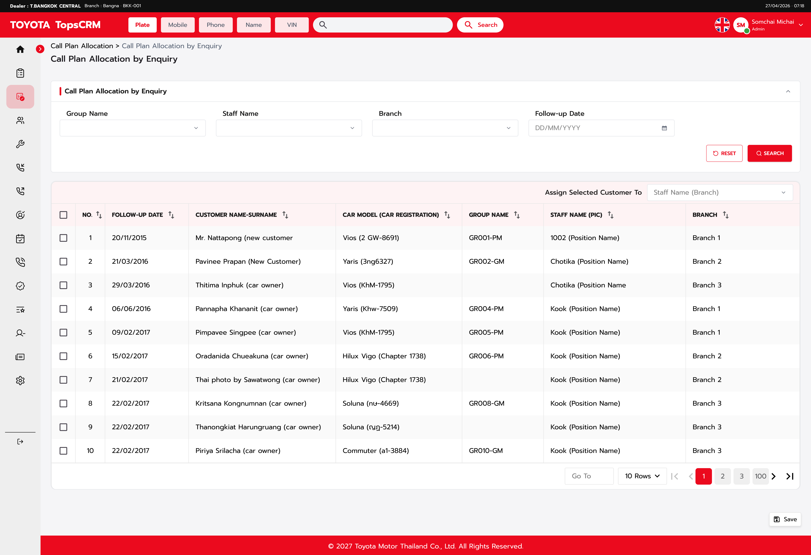

# [WCRM020104] Call Plan Allocation By Enquiry agenticDR

# [WCRM020104] Call Plan Allocation By Enquiry

| Field | Value |
| --- | --- |
| Function Name | Call Plan Allocation by Enquiry |
| Document Status | N/A |
| Created By | Om Pandey |
| Created Date | Aug 10, 2026 |
| Legacy Function ID | N/A |

## Revision History

| S. No. | Version No. | Revised For | Updated By | Updated Date | Reviewed By | Reviewed Date |
| --- | --- | --- | --- | --- | --- | --- |
| 1 | v1.0 | Initial DRD generated by create-dr agent | Om Pandey | Aug 10, 2026 | N/A | N/A |

# Objective

The Call Plan Allocation by Enquiry function allows users to view, manage, and reassign manually created call plans that are not generated through Night Batch Processing, Activity Configuration, Activity Setup modules, or Automated Call Plan Generation processes.

This screen is specifically designed for call plans created through customer enquiries, inbound calls, missed call callbacks, customer follow-up requests, callback requests, and manually scheduled follow-up activities (for example: a customer calls the dealership and requests a follow-up, a dealer receives a missed call and performs a callback, a Service Advisor schedules a future follow-up, or a previously incomplete follow-up requires another call). These manually created call plans may or may not be associated with a Call Center Group.

Users can search, view, and reassign enquiry call plans to another staff member according to their authorization level, Role Function Matrix, and the authorization matrix (for TMT users).

## Pre-condition

- User must be logged into the CRM system with valid credentials.

- Dealer User access shall be controlled through the Role Function Matrix; user must have the applicable access (View Screen, Search, Reassign Call Plans, Save Allocation) as per role.

- TMT User access shall be controlled through the authorization matrix.

- Manually created enquiry call plans (from customer enquiries, inbound calls, missed call callbacks, follow-up requests, callback requests, or manually scheduled follow-ups) must exist for the records to be displayed.

## Post-condition

- On successful Save, the selected enquiry call plan record(s) shall be reassigned to the selected destination staff (Assign Selected Customer To).

- The assigned Staff Name (PIC) shall be updated for all selected records; Branch value and Call History shall remain unchanged.

- The search result grid shall automatically refresh after reassignment and Save.

# Display Order

| Section | No. | Field Name | Order (ASC / DESC) |
| --- | --- | --- | --- |
| Grid Section | 1 | Follow-up Date | ASC |

Oldest Follow-up Date shall appear first (default grid sorting).

# Access Control

User access shall be controlled through the Role Function Matrix (Dealer User roles) and the authorization matrix (TMT User). No common access Excel sheet/document link is stated in the business document.

| Role | Screen Access |
| --- | --- |
| Dealer Management User | Y &mdash; as per Role Function Matrix |
| Manager | Y &mdash; as per Role Function Matrix |
| Call Center Staff | View Only / As per role matrix; reassignment as per authorization matrix |
| TMT User | Controlled through authorization matrix |

## Function-Level Access (Dealer Management User)

| Function | Access |
| --- | --- |
| View Screen | Yes |
| Search | Yes |
| Reassign Call Plans | Yes |
| Save Allocation | Yes |

## Function-Level Access (Manager)

| Function | Access |
| --- | --- |
| View Screen | Yes |
| Search | Yes |
| Reassign Call Plans | Yes |
| Save Allocation | Yes |

## Function-Level Access (Call Center Staff)

| Function | Access |
| --- | --- |
| View Screen | View Only / As per role matrix |
| Reassignment | As per authorization matrix |

# Button Settings

## Screen Mode

This screen uses Initial / Search / Reset modes (no Add/Edit modes &mdash; see Screen-Specific Operations for the N/A template operations).

| Screen Mode No. | Screen Mode | Section No. | Section | Description |
| --- | --- | --- | --- | --- |
| 1. | Initial Mode | a. | Search Area | On page load, none of the search criteria are mandatory. Group Name defaults to blank, Staff Name defaults to All, Branch defaults to All (or per user authorization), Follow-up Date defaults to blank. |
|  |  | b. | Grid Section | All available enquiry call plans within the user's authorization scope are displayed automatically, sorted by Follow-up Date Ascending, with default pagination. |
|  |  | c. | Action Section | Assign Selected Customer To defaults to blank; Save is available according to the user's role/authorization. |
| 2. | Search Mode | a. | Search Area | User enters/changes Group Name, Staff Name, Branch, and/or Follow-up Date and clicks Search. None of the criteria are mandatory. |
|  |  | b. | Grid Section | System performs the search using the selected conditions; the result grid and pagination refresh accordingly. |
|  |  | c. | Action Section | Save remains available according to the user's authorization; user may select record(s) and a destination staff for reassignment. |
| 3. | Reset Mode | a. | Search Area | Reset clears all search criteria: Group Name becomes blank, Staff Name returns to All, Branch returns to its default value, Follow-up Date becomes blank. |
|  |  | b. | Grid Section | System reloads all available enquiry call plans within the user's authorization scope. |
|  |  | c. | Action Section | Selected grid record(s) and destination staff selection are cleared; Save returns to its default state. |

Button State: E = Enable, - = Not Available, D = disable

| Mode/Section | Search | Reset | Save |
| --- | --- | --- | --- |
| 1.a | E | E | - |
| 1.b | - | - | - |
| 1.c | - | - | E |
| 2.a | E | E | - |
| 2.b | - | - | - |
| 2.c | - | - | E |
| 3.a | E | E | - |
| 3.b | - | - | - |
| 3.c | - | - | E |

# Menu Path

| No. | Menu Name |
| --- | --- |
| 1 | Main Menu -> Call Plan Allocation -> Call Plan Allocation by Enquiry |

# Screen Flow

- User logs into the CRM system and navigates: Main Menu -> Call Plan Allocation -> Call Plan Allocation by Enquiry.

- The Call Plan Allocation by Enquiry screen (WCRM020104) is displayed. On load, all manually created enquiry call plans within the user's authorization scope are displayed automatically (Grid Section), sorted by Follow-up Date Ascending, with none of the search criteria pre-applied.

Sample flow &mdash; Search:

- User selects a Follow-up Date in the Search Criteria Area (Section A).

- User clicks the Search button.

- System displays only the enquiry call plans matching the selected Follow-up Date in the Search Result Grid (Section B), refreshing the grid and pagination (Section D).

Sample flow &mdash; Reassignment:

- User selects one or more records in the Search Result Grid.

- User selects a destination staff in the Assign Selected Customer To dropdown (Section C).

- User clicks Save (Section E); the selected records are reassigned to the destination staff and the grid refreshes.

# UX Design

Link : N/A

## Screen UX

# Item Description

Please refer sheet Item_Desc as attached.

`Item_Desc_Call_Plan_Allocation_by_Enquiry.xlsx`

# Screen API Details

Please refer sheet API_Details.

`API_Data_Map_Details_Call_Plan_Allocation_By_Enquiry.xlsx`

# Data Map

Please refer sheet DATA_MAP.

N/A &mdash; Data Map workbook is out of scope for this phase.

# Validation Rules (Error Messages)

## Common Messages (Errors, Warnings, and Information)

| S. No. | Event | Cause | Type | Message ID | Display Message | Action |
| --- | --- | --- | --- | --- | --- | --- |
| 1 | Save | No grid record selected | Error | N/A | Please select at least one enquiry call plan. | User selects at least one enquiry call plan and retries Save. |
| 2 | Save | No destination staff selected in Assign Selected Customer To | Error | N/A | Please select staff for assignment. | User selects a destination staff and retries Save. |
| 3 | Save | User not authorized to perform the operation | Error | N/A | You are not authorized to perform this operation. | Click OK to remain on the screen. |

## Screen Specific Errors

| S. No. | Event | Cause | Type | Message Id | Log Message | Action |
| --- | --- | --- | --- | --- | --- | --- |
| 1 | Save | Selected destination staff is inactive | Validation | N/A | Selected staff is inactive. | Select any other (active) staff and try again. |

# Operation Description

## ⬇️ 1. On-Load Operation

### TMT Login

#### Default Data

- Group Name defaults to blank.

- Staff Name defaults to All.

- Branch defaults to All.

- Follow-up Date defaults to blank.

- All enquiry call plans available within the TMT user's authorization scope are displayed automatically, sorted by Follow-up Date Ascending.

- Records with and without Group Name are displayed.

#### Enable/Disable Controls

- Access shall be controlled through the authorization matrix.

### Dealer Login (Dealer Management User / Manager)

#### Default Data

- Group Name defaults to blank.

- Staff Name defaults to All.

- Branch defaults to All, or as per the user's authorization.

- Follow-up Date defaults to blank.

- All enquiry call plans available within the logged-in user's authorization scope are displayed automatically.

- Records with and without Group Name are displayed.

#### Enable/Disable Controls

- View Screen, Search, Reassign Call Plans, and Save Allocation are enabled &mdash; access is Yes per the Role Function Matrix.

### Call Center Staff Login

#### Default Data

- Group Name defaults to blank.

- Staff Name defaults to All.

- Branch values shall be populated according to the logged-in user's authorization; only accessible branches are displayed.

- Follow-up Date defaults to blank.

- Enquiry call plans within the staff member's authorized scope are displayed automatically.

#### Enable/Disable Controls

- View Screen is View Only / As per role matrix.

- Reassignment is enabled as per the authorization matrix.

### Common On-Load Details

- On page load, all available enquiry call plans (within the user's authorization scope) shall be displayed automatically.

- None of the search criteria are mandatory, because enquiry-based call plans may exist without Call Center Group assignment.

- The result grid shall be sorted by Follow-up Date Ascending (oldest Follow-up Date first).

- Staff Name shall default to All.

- The user may filter results using any combination of Group Name, Staff Name, Branch, and Follow-up Date.

- Records with and without Group Name shall both be displayed.

### Pagination

- Pagination is required; see Pagination Behavior for default page size, available page sizes, and controls.

### ⬆️ Pre-Submit Validations (Frontend Check)

- Format Checking: Follow-up Date shall accept only a valid calendar date (via the Calendar control).

- Range Value Checking: N/A &mdash; not stated in the business document beyond the fixed page-size options in Pagination (10, 20, 50, 100).

- Duplicate Checking: N/A &mdash; not applicable to this screen.

- Dependent Combo/Dropdown Validation: Staff Name and Branch dropdown values shall remain within the logged-in user's authorization scope; Branch values shall be populated according to the logged-in user's authorization and only accessible branches shall be displayed.

- File Upload Validation: N/A &mdash; this screen has no upload function.

- Cross-field Validation: Before Save, the user must have selected at least one enquiry call plan record in the grid and a destination staff in Assign Selected Customer To.

- Character Limit / Max Length Checking: N/A &mdash; not stated in the business document.

- Mandatory Selection Validation: Save processing shall not continue when no grid record is selected ("Please select at least one enquiry call plan.") or when no destination staff is selected ("Please select staff for assignment.").

### Post-Submit Validations (Business Validations)

- User Permission / Access Validation: System shall validate the user's authorization before Save; if the user is not authorized, the system displays "You are not authorized to perform this operation."

- Master Data Check: System shall verify the selected destination staff exists; if the selected staff is inactive, the system displays "Selected staff is inactive."

- Status Transition Validation: N/A &mdash; not stated in the business document.

- Referential Integrity Checks: N/A &mdash; not stated in the business document.

- Operation Flow Check: System shall confirm at least one enquiry call plan is selected and a destination staff is selected before processing Save.

- Concurrency / Locking Checks: N/A &mdash; not stated in the business document.

- Business Rule Validation: Only the assigned PIC (Staff Name) shall be updated on successful reassignment; Call History and Branch value shall remain unchanged.

### On Successful Operations (Screen behavior)

- Screen Mode Transition: After Search, the screen remains in Search Mode. After Reset, the screen returns to Initial Mode (all available enquiry call plans reloaded).

- Data Refresh / Search Result Refresh: Search results grid refreshes according to selected conditions; pagination refreshes accordingly. After a successful Save, search results shall be refreshed and the updated Staff Name (PIC) shall be displayed.

- Cursor Position: N/A &mdash; not stated in the business document.

- Field Enable/Disable State: N/A &mdash; not stated in the business document beyond the Button Settings state matrix.

- Button State Change: Button states follow the Button Settings matrix for the resulting mode.

- Audit Trail / Logging: N/A &mdash; not stated in the business document.

- Pagination Reset: Pagination shall refresh after Search and after Reset.

- Inline Editing: N/A &mdash; grid values are display-only; no inline editing is described in the business document.

- Redirect / Navigation: N/A &mdash; not stated in the business document.

- Confirmation Message: N/A &mdash; not stated in the business document.

- Event Trigger (Notifications, Email, SMS): N/A &mdash; not stated in the business document.

- Other System Integration: N/A &mdash; not stated in the business document.

- Data Update Behavior: On successful Save, the assigned PIC (Staff Name) is updated for all selected records; Call History remains unchanged; Branch value remains unchanged.

### On Error Operations (Screen Behaviour)

- Screen Mode Retention: N/A &mdash; not explicitly stated in the business document; no rollback of entered search criteria is described.

- Error Message Reference: The applicable message from Validation Rules (Error Messages) is displayed based on the failed operation (no record selected, no destination staff selected, selected staff inactive, or user not authorized).

- Field Highlighting: N/A &mdash; not stated in the business document.

- Cursor Positioning on Error Field: N/A &mdash; not stated in the business document.

- Rollback Behaviour: N/A &mdash; not stated in the business document.

- Logging of Failed Operations: N/A &mdash; not stated in the business document.

## Search Area

Allows users to filter manually created enquiry call plans. Unlike Today's Call Plan List and Call Plan Allocation screens, none of the search criteria are mandatory, because enquiry-based call plans may exist without Call Center Group assignment. On page load, all available records shall be displayed automatically.

| Field | Control Type | Mandatory | Default Value |
| --- | --- | --- | --- |
| Group Name | Dropdown | No | Blank |
| Staff Name | Dropdown | No | All |
| Branch | Dropdown | No | All |
| Follow-up Date | Calendar | No | Blank |

### a. Group Name

- Group Name is optional; default value is blank.

- Values shall be retrieved from the Call Center Group Master.

- The dropdown shall support search functionality.

- Single selection only.

- When Group Name is blank, the search result shall include enquiry plans mapped to any Call Center Group, records having a blank Group Name, and staff assigned without a Call Center Group.

### b. Staff Name

- Staff Name is optional; default value is All.

- Dropdown values: All, Staff Name 1, Staff Name 2, ... Staff Name n.

- Only active staff shall be displayed.

- Staff list shall be filtered according to the user's authorization scope.

### c. Branch

- Branch is optional; default value is All.

- Branch values shall be populated according to the logged-in user's authorization; only accessible branches shall be displayed.

- The dropdown shall support search functionality.

- Single selection only.

### d. Follow-up Date

- Follow-up Date is optional; default value is blank.

- Uses a Calendar control; user selects a single Follow-up Date.

- The date filter shall return matching enquiry call plans only.

## Search Operation

When the user clicks Search:

- System shall perform the search using the selected conditions.

- The result grid shall refresh accordingly.

- Pagination shall refresh accordingly.

## Reset Operation

When the user clicks Reset:

- All search criteria shall be cleared.

- Staff Name shall return to All.

- Group Name shall become blank.

- Branch shall return to its default value.

- Follow-up Date shall become blank.

- System shall reload all available enquiry call plans.

## Grid Section

Displays manually created enquiry call plans. Default sorting: Follow-up Date Ascending (oldest Follow-up Date first).

### Grid Columns

| No. | Column Name |
| --- | --- |
| 1 | Selection Checkbox |
| 2 | No. |
| 3 | Follow-up Date |
| 4 | Customer Name - Surname |
| 5 | Car Model (Car Registration) |
| 6 | Group Name |
| 7 | Staff Name (PIC) |
| 8 | Branch |

### Column Definitions

Selection Checkbox &mdash; Allows the user to select one or multiple records for reassignment.

No. &mdash; System-generated running serial number.

Follow-up Date &mdash; Represents the scheduled callback/follow-up date.

Customer Name - Surname &mdash; Displays the customer's full name.

- New Customer Indicator: when the customer record does not yet exist in the system, the display format is Customer Name (New Customer) &mdash; e.g. Mr. Nattapong (New Customer) .

- Note: customer confirmation is pending; this business rule remains open for final customer validation.

Car Model (Car Registration) &mdash; Displays Vehicle Model (License Plate). Examples: Vios (GW-8691), Hilux Vigo (Chapter 1738), Yaris (Khw-7509).

Group Name &mdash; Displays the assigned Call Center Group (e.g. GRO01-PM, GRO02-GM, GRO04-PM). May remain blank when no group assignment exists.

Staff Name (PIC) &mdash; Displays the currently assigned responsible staff, formatted as Staff Name (Position) &mdash; e.g. Chotika (Manager), Kook (Call Center Staff).

Branch &mdash; Displays the branch responsible for the enquiry call plan.

### Grid Behavior

- Multiple records may be selected.

- Records shall be displayed according to the search criteria.

- Users may select records across multiple pages.

- Search results shall be refreshed after reassignment and Save.

- Grid data shall be filtered according to authorization.

## Add Operation

N/A &mdash; this is a search-and-allocate screen; the business document does not describe an Add flow.

## Edit Operation

N/A &mdash; the business document does not describe an inline Edit flow; only reassignment of PIC via the Assign Selected Customer To dropdown and Save is supported.

## Delete Operation

N/A &mdash; the business document does not describe a Delete flow.

## Assignment Operation (Assign Selected Customer To)

Purpose: Allows reassignment of enquiry call plans to another staff member. Located above the result grid.

Control Type: Single Select Dropdown.

Staff Values: Dropdown displays Staff Name (Branch) &mdash; e.g. Somchai Michai (Branch 001), Kook (Branch 002), Chotika (Branch 003).

Behaviour

| No. | Requirement |
| --- | --- |
| 1 | Only active staff shall be displayed. |
| 2 | Staff shall be filtered according to authorization. |
| 3 | Single selection only. |
| 4 | One or more grid records must be selected before reassignment. |

Reassignment Rules

| No. | Requirement |
| --- | --- |
| 1 | User may select multiple enquiry call plans. |
| 2 | User selects destination staff from the Assign Selected Customer To dropdown. |
| 3 | Selected records shall be reassigned to the destination staff. |
| 4 | Call History shall remain unchanged. |
| 5 | Only PIC assignment shall change. |
| 6 | Branch value shall remain unchanged. |

## Save Operation

Purpose: Commit reassignment changes.

Behaviour

| No. | Requirement |
| --- | --- |
| 1 | User must select at least one record. |
| 2 | User must select destination staff. |
| 3 | System shall validate authorization before save. |
| 4 | Successful save shall update assigned PIC. |
| 5 | Grid shall automatically refresh. |

Validations

| Validation | Scenario | Message |
| --- | --- | --- |
| Validation 1 | No grid record selected. | Please select at least one enquiry call plan. |
| Validation 2 | No destination staff selected. | Please select staff for assignment. |
| Validation 3 | Selected staff inactive. | Selected staff is inactive. |
| Validation 4 | User not authorized. | You are not authorized to perform this operation. |

## Exit Operation

N/A &mdash; the business document does not describe an Exit flow for this screen.

## Upload Operations

N/A &mdash; the business document does not describe an upload function for this screen.

## Download Operations

N/A &mdash; the business document does not describe a download function for this screen.

## Report Calling Operations

N/A &mdash; the business document does not describe a report-calling function for this screen.

## Other Screen-Specific Operations

N/A &mdash; no other screen-specific operations beyond Search, Reset, Assignment, and Save are described in the business document.

## Pagination Behavior

Default Page Size: 10 Records.

Available Page Sizes: 10, 20, 50, 100.

Controls: First Page, Previous Page, Next Page, Last Page, Go To Page.

Behaviour

| No. | Requirement |
| --- | --- |
| 1 | Pagination shall be applied after search filtering. |
| 2 | Sorting shall remain unchanged across pages. |
| 3 | Search criteria shall remain unchanged during navigation. |
| 4 | Total record count shall be displayed. |
| 5 | Current page shall be highlighted. |

# Integration With Landing Page

N/A &mdash; the business document does not describe any dashboard/landing-page widget, deep link, or counter tied to this screen.
